# How Well Do Hackathon Web Apps Hold Up?

### A black box study of 1,579 live apps from 80 hackathons

**Curve:** `2026.4` (final) · **Instrument:** Sloptic 3.0, a deductions only black box grader · **Run:** `multihacksv26retried.jsonl`, graded 2026-09-21 to 2026-09-23 · **Data:** `validation/corpus-figures-active.json`, figures in `docs/charts/`

> Every number here comes from `scripts/stats.py` run on the file above. The aggregate figures are in
> `validation/corpus-figures-active.json` (`--corpus-json`). The figures and every hypothesis test are in
> `docs/charts/` (`--charts`), and each image has a CSV next to it with the exact values it plots.
> Nothing in this report names an app or a team.

---

## Abstract

We graded every live web app we could find in the Devpost galleries of 80 hackathons. Of 2,685 submissions
with a URL, 1,579 produced a valid grade. We used Sloptic, a grader that probes an app from the outside and
returns a slop score: the sum of deductions for failures that count against any app, whatever it is for. Lower
is better.

The median app scores 48.0 and no app scores 0. About two thirds of all slop comes from three sources:
missing security headers, accessibility failures, and Lighthouse performance below 90. Each of the four
header probes fires on 90 to 98% of apps.
Worse problems are common too. 27.5% of apps have at least one critical finding (priced above 40), and most of
those are functional: a crash on bad input, or a page too slow to use. 4.7% of apps (75) are exploitable
today. Most of those ship a live API credential in their client code or leave a managed database open to
anonymous reads.

Three comparisons stand out. AI builder apps are no sloppier overall (p = 0.16), but they leave their backend
open about 22 times as often as hand built apps (13.4% against 0.6%, p < 10⁻⁹). Hackathon winners are no cleaner than the apps they
beat. They are equal on everything except performance, where they are measurably worse (p = 0.001). The four
axes of the score are close to independent (every pairwise |ρ| ≤ 0.14), so a fast app tells you almost nothing about
whether it is secure or accessible.

---

## 1. Introduction

AI tools made it cheap to ship a web app that looks finished. Most research on what that costs reads source
code. Veracode's 2025 study found that 45% of AI generated code samples introduced an OWASP Top 10 flaw. The
Cloud Security Alliance put the share of AI generated solutions with a design flaw or known vulnerability at
62%.

We took the opposite view. A user, an attacker, or a judge sees a running app with no source and no spec. We
wanted to know what failure looks like from there, measured across a large population of real deployed apps.

We asked five questions.

- **RQ1.** What does the distribution of slop look like, and what is it made of?
- **RQ2.** How much of it is exploitable, and what kind?
- **RQ3.** Do apps built with an AI app builder carry more slop than hand built ones?
- **RQ4.** Do hackathon winners hold up better than the apps they beat?
- **RQ5.** How much of each app can a black box grader reach?

## 2. Data

### 2.1 Collection

We scraped the public galleries of 80 Devpost hackathons (Appendix A) and kept every submission that listed a
live URL. That gave 2,685 apps. Most events are North American university hackathons from 2025 and 2026. The
rest are in Europe, Latin America and Asia Pacific. One 2023 edition stays in as an older reference point.
These apps are young, small, and built in a day or two. They are not a sample of production software.

### 2.2 From 2,685 URLs to 1,579 grades

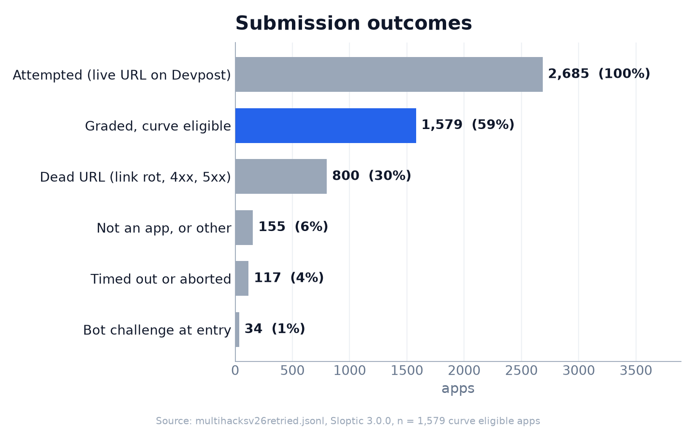

| outcome | apps | share of attempted |
|---|---:|---:|
| graded and curve eligible | 1,579 | 58.8% |
| dead URL (link rot, 4xx, 5xx) | 800 | 29.8% |
| not an app, or other | 155 | 5.8% |
| timed out or aborted | 117 | 4.4% |
| bot challenge at entry | 34 | 1.3% |

Almost 30% of the links were dead, lost to expired domains and free tiers that spun down. That makes the
graded set a survivor sample: these are the apps that stayed up.

1,740 URLs returned a score. We excluded 161 of them from the curve under rules fixed before this run. 86
were canvas shells, mostly Streamlit, where the grader measures the framework and not the app. 48 hit a bot
challenge before 60% of the battery ran. 21 pointed at a third party page (a slide deck, a package registry,
an app store listing) and not the team's own app. 6 were challenged at entry. Every statistic below uses the
1,579 eligible apps unless it says otherwise.

### 2.3 Bot challenges

Vercel's bot protection challenged the grader on 553 of its 1,107 apps (50%). Across the whole run, 588
records (21.9%) saw a challenge. Most challenges (506) came after every probe had run, so those grades are
complete and kept. On 162 kept apps an axis is marked incompletely tested because the edge blocked some of
its probes (security on 161 of them). The heavy probes tripped it most: `sec-dos-001` (131), `sec-upload-002`
(79), `sec-cmdi-001` (69) and `sec-hosthdr-001` (55).

## 3. Method

### 3.1 The instrument

Sloptic reads no source and needs no spec. It crawls and renders the app, maps its routes, forms and
endpoints, then runs a fixed battery of 106 probes. Each probe tests one failure that counts against any app:
a missing security header, a crash on malformed input, a control that does nothing, a live credential in the
bundle, a database open to anonymous reads. A probe that does not apply returns N/A with a reason. It never
passes silently.

Each finding carries a penalty priced as frequency times severity. The penalties sum to the slop score, which
has no upper bound. Two dampers keep one flaw from counting many times: techniques that detect the same flaw
fire once, and each extra finding in the same category counts 0.6 times the one before. The score splits into
four axes that sum exactly to the total: security, quality, accessibility and performance.

No language model contributes to the number. Accessibility runs on pinned axe-core 4.10.2, and performance
on pinned Lighthouse 13.4.1 (mobile preset, median of three runs).

### 3.2 The reference curve

This run is the frozen reference curve `2026.4`. A single grade becomes a percentile against it. The curve
applies a small performance correction for how busy the grading box was (`docs/PERF_NORMALIZATION.md`), so
its median is 48.4. The tables in this report use raw scores, where the median is 48.0.

### 3.3 Severity

We sort findings into five bands by penalty: minor (1 to 10), moderate (11 to 20), serious (21 to 30), severe
(31 to 40) and critical (41 and up). Two derived levels use each app's single worst finding. An app is
**acute** if its worst finding is critical, and **significant** if its worst finding is serious or above.
**Exploitable** is narrower: the app has at least one finding an attacker can use today, such as a live
credential or an open database.

### 3.4 Statistical tests

Slop is skewed, so we compare groups with rank tests: Mann-Whitney U for two groups and Kruskal-Wallis for
several. For rates we use Fisher's exact test. For association we use Spearman's ρ. The confidence interval
on the median is a percentile bootstrap (2,000 resamples, seed 0). We treat p < 0.05 as significant and did
not correct for multiple comparisons. Appendix B lists every test.

## 4. Results

### 4.1 The distribution (RQ1)

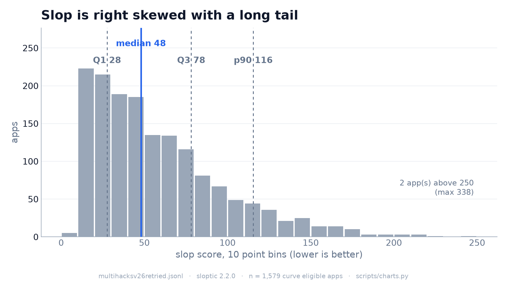

| statistic | value |
|---|---:|
| n | 1,579 |
| median (95% CI) | 48.0 (45.9 to 51.0) |
| mean | 58.6 |
| standard deviation | 40.4 |
| Q1 / Q3 | 27.6 / 78.2 |
| p90 / p99 | 115.5 / 178.7 |
| min / max | 1.0 / 337.5 |
| skewness / excess kurtosis | 1.40 / 2.94 |
| distinct values | 832 (52.7%) |

The distribution has one peak and a long right tail. No app scored 0, and the lowest scored 1.0. The mean sits
10 points above the median because of the tail.

The most common score is 13.7, shared by 83 apps (5.3%). That is what the four missing security headers cost
on their own. 45 apps have no finding except missing headers.

### 4.2 What the score is made of (RQ1)

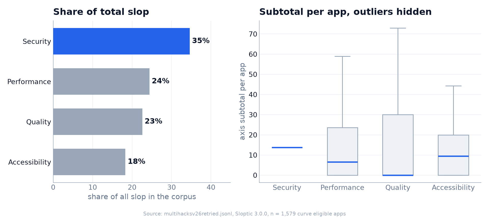

| axis | share of all slop | median | mean | apps with any |
|---|---:|---:|---:|---:|
| security | 34.6% | 13.7 | 20.3 | 1,572 |
| performance | 24.4% | 6.5 | 14.3 | 1,378 |
| quality | 22.6% | 0.0 | 13.3 | 896 |
| accessibility | 18.3% | 9.5 | 10.7 | 1,052 |

Medians count apps with nothing on that axis as zero. Security is almost always present and usually small.
The median and both quartiles all sit at the header floor of 13.7. Quality is the reverse. Most apps have none, but
the top quarter carry 30 or more.

By category, three sources carry about two thirds of all slop: Lighthouse performance (24.1%), security
headers (22.6%) and accessibility (18.1%). After those come crash resistance (8.2%), dead controls (7.2%) and
secrets exposure (4.3%).

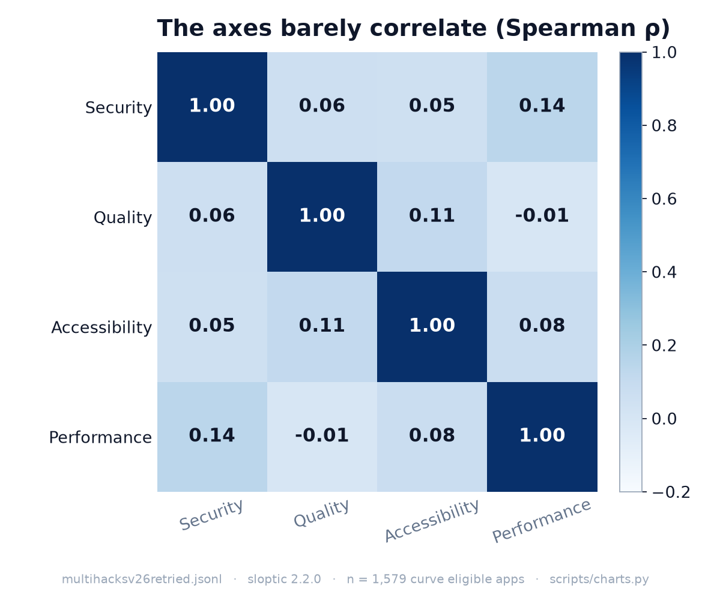

The axes barely move together. The strongest pairwise Spearman correlation is 0.14, between security and
performance, and quality against performance is −0.01. Lighthouse score against all slop outside performance
gives ρ = −0.07. The axes measure different things, and a good score on one predicts almost nothing about
the others.

### 4.3 What fires

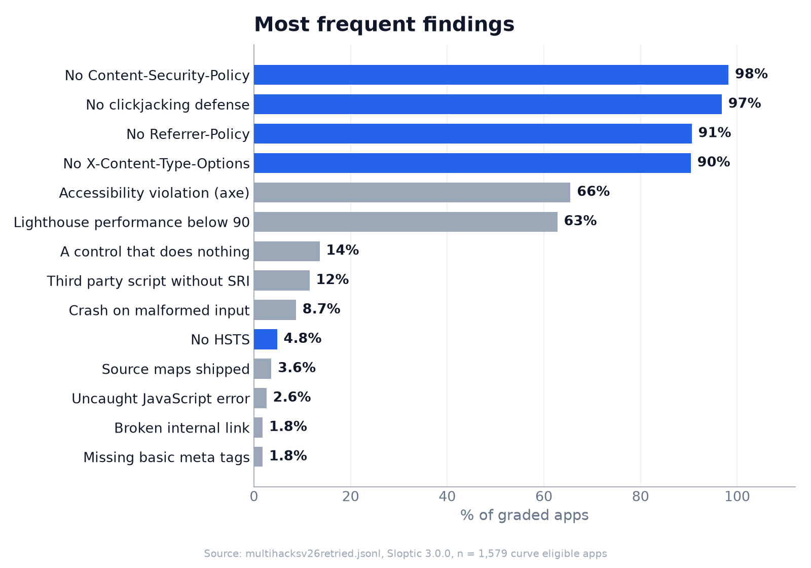

The four header probes fire on 90 to 98% of apps. 1,550 of 1,579 apps (98.2%) send no Content Security
Policy. A probe that fires on nearly everyone is close to a constant: it costs every app about the same and
barely changes the ranking. The spread comes from the middle of the chart. Accessibility fires on 65.5% of
apps, Lighthouse below 90 on 62.8%, a dead control on 13.6%, an unpinned third party script on 11.5%, and a
crash on malformed input on 8.7%.

Four probes never applied to any app: `qa-race-001`, `qa-race-002`, `sec-idor-002` and `sec-idor-003`. Each
needs a surface (a drivable signup, or a create and read API pair) that no app exposed to us. Another 45
probes applied somewhere and never fired.

### 4.4 Severity

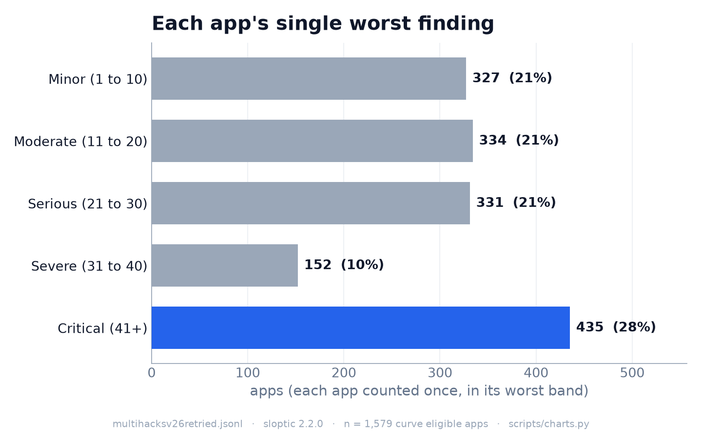

| each app's worst finding | apps | share |
|---|---:|---:|
| critical (41+) | 435 | 27.5% |
| severe (31 to 40) | 152 | 9.6% |
| serious (21 to 30) | 331 | 21.0% |
| moderate (11 to 20) | 334 | 21.2% |
| minor (1 to 10) | 327 | 20.7% |

58.1% of apps (918) are significant: their worst finding is serious or above. The median worst finding is 27
(Q1 12, Q3 46.1).

The acute tier is mostly broken apps, not hacked ones. Of the 506 critical findings, 43.1% are quality and
36.2% are performance, which leaves 20.8% for security. The top critical findings are a Lighthouse score in
the red (178 apps), a crash on malformed input (137), and a client bundle pointing at a backend real visitors
cannot reach (23). A password reset email that never arrives accounts for 15.

### 4.5 The exploitable slice (RQ2)

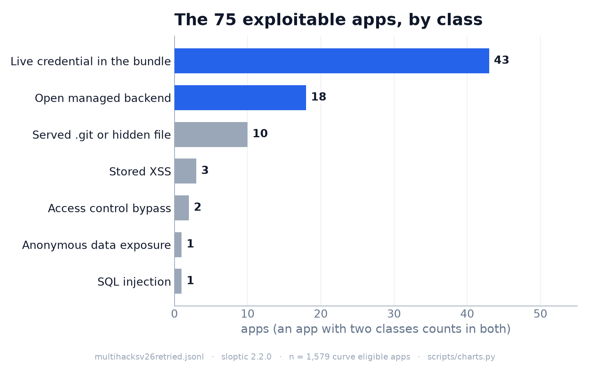

75 apps (4.7%) have at least one exploitable finding.

| class | apps |
|---|---:|
| live credential in the client bundle | 43 |
| open managed backend | 18 |
| served `.git` directory or hidden file | 10 |
| stored XSS | 3 |
| access control bypass | 2 |
| anonymous data exposure | 1 |
| SQL injection | 1 |

An app with two classes counts in both rows. The largest class is a live credential shipped to the browser.
The most common case, on 27 apps, is a Google API key that can call the Gemini API, so anyone who opens the
page can spend the team's quota. The second class is a Supabase or Firebase database left open. On 16 apps,
row level security was off, so an anonymous client could read or write rows. On 5 of them it could read
records in bulk. Every backend finding is confirmed by a live request, not inferred from configuration.

Classic injection barely registers: one SQL injection and three stored XSS. That reflects reach more than
safety, as Section 4.9 shows.

### 4.6 AI builders (RQ3)

The grader identifies Lovable and Bolt apps from their served markup.

| builder | n | median slop | security mean | quality mean | accessibility mean | performance mean |
|---|---:|---:|---:|---:|---:|---:|
| hand built | 1,497 | 47.9 | 19.9 | 13.1 | 10.7 | 14.2 |
| Lovable | 73 | 50.2 | 24.2 | 15.4 | 12.5 | 17.0 |
| Bolt | 9 | 55.2 | 45.5 | 29.3 | 10.0 | 1.8 |

Overall, Lovable apps are not significantly sloppier than hand built apps (one sided Mann-Whitney, p = 0.16).
Bolt has only 9 apps, too few to test.

The difference is in the backend. 11 of the 82 AI builder apps (13.4%) have an exposed managed backend,
against 9 of 1,497 hand built apps (0.6%). That is about 22 times the rate (odds ratio 25.6, Fisher's exact
test, p = 4.4 × 10⁻¹⁰).
Both builders offer Supabase as a built in backend, and many of their apps ship tables with no access rules.

### 4.7 Winners (RQ4)

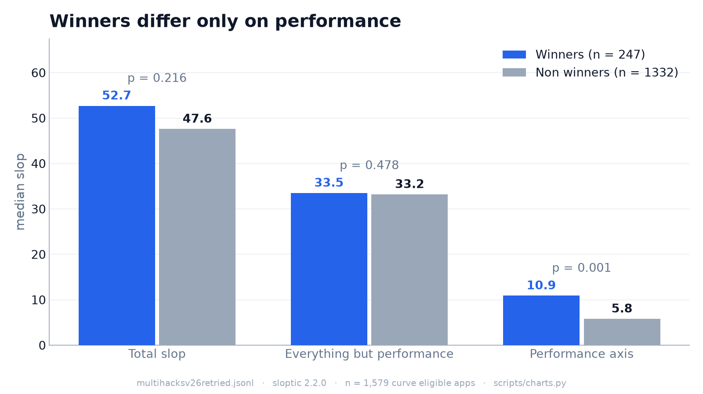

The dataset records which apps won a prize at their event. 247 of the graded apps did.

| comparison | winners | non winners | p (two sided) |
|---|---:|---:|---:|
| median total slop | 52.7 | 47.6 | 0.22 |
| median slop outside performance | 33.5 | 33.2 | 0.48 |
| median performance axis | 10.9 | 5.8 | 0.001 |
| median Lighthouse score | 78 | 83.5 | 0.003 |
| median observed surface size | 26 | 25 | 0.70 |

Winners score 11% higher on median slop, but the gap is not significant. The breakdown explains it. On
security, quality and accessibility combined, the two groups are the same. The whole gap is performance:
winners have a lower Lighthouse score (30.2% reach green against 36.8%) and nearly twice the median
performance slop.

One guess is that winners are bigger apps with more surface for slop to land on. The data does not support
that. Their observed surface is the same size. They are slower, not larger. Judges reward the idea, the demo
and the pitch, and none of those predicts whether an app holds up.

### 4.8 Platforms and events

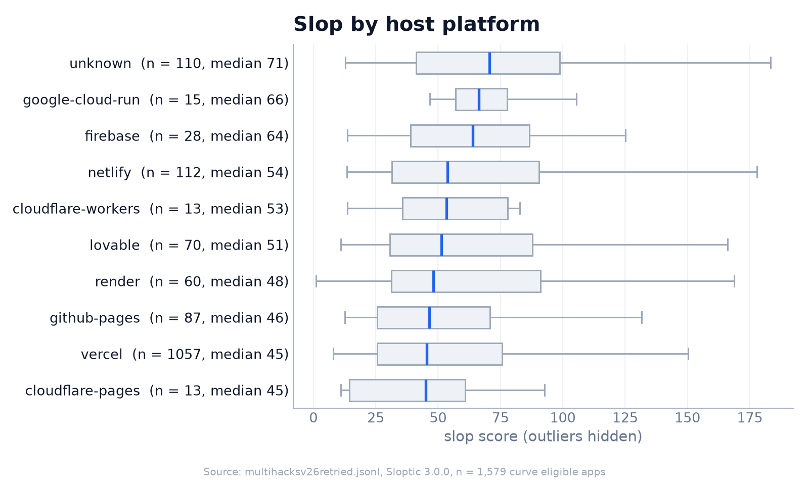

Slop differs by host platform (Kruskal-Wallis across the 10 platforms with at least 10 apps, p = 3.7 ×
10⁻⁶). Static hosts sit lowest: Cloudflare Pages at a median of 45.1, Vercel at 45.4 (1,057 apps) and GitHub
Pages at 46.4. Hosts that run a backend sit higher: Firebase at 63.9 and Google Cloud Run at 66.3. Apps on
unidentified hosts, mostly custom domains, have the highest median at 70.6. A backend means more surface, and
more surface means more room for failure. Across all apps, slop correlates weakly with observed surface size
(ρ = 0.14, p < 10⁻⁷).

Events differ less. Among the 49 events with at least 10 graded apps, the medians range from 26.4 to 101.8.
A Kruskal-Wallis test gives p = 0.03, which is weak evidence after this many comparisons.

| sloppiest events (median) | | cleanest events (median) | |
|---|---:|---|---:|
| `hack-brown-2026` (n 12) | 101.8 | `vibehack-london-2026` (n 21) | 26.4 |
| `ellehacks-2026` (n 14) | 71.0 | `oregonhacks` (n 28) | 26.8 |
| `diamondhacks-2026` (n 27) | 67.9 | `bostonhacks-2025` (n 13) | 32.9 |
| `hackpsu-spring-2026` (n 15) | 64.7 | `unihack2026` (n 52) | 35.9 |
| `swamphacks-xi` (n 18) | 63.3 | `cs-girlies-wellness-hackathon` (n 31) | 36.8 |

The largest and best known events land in the middle.

### 4.9 Reach (RQ5)

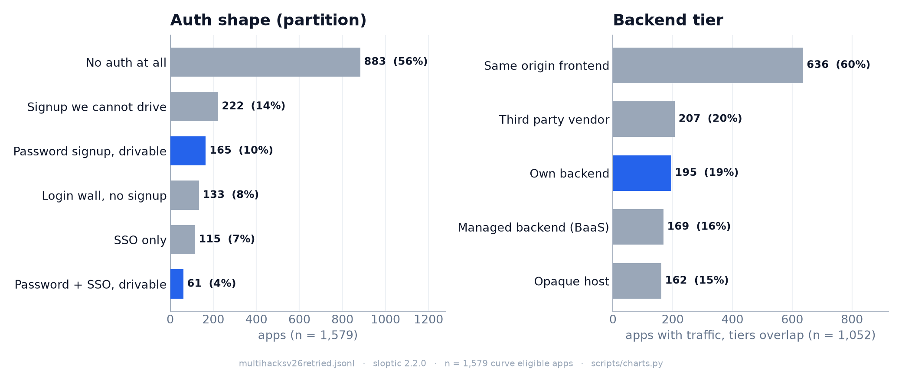

A black box grader only tests what it can reach, and three things limit that here.

Most apps have no backend we can attack. We observed runtime traffic on 1,052 apps. Only 195 of them (19%)
call a backend of their own that the grader can probe. 169 (16%) use a managed backend, which the grader can
only test through its access rules. The largest tier is same origin traffic (636 apps, 60%), typical of a
static frontend. The tiers overlap, because one app can talk to several.

Most apps have no account we can create. 883 apps (56%) have no auth at all. Only 226 (14%) offer a password
signup the grader can complete. Of those 226, 13 had a finding behind the login. The most common was a
confirmation or reset email that never arrived.

Bot challenges limit the rest. On 161 apps the security axis is incompletely tested.

The injection probes show the cost. `sec-cmdi-001` applied to 934 apps, sent a median of 74 requests to each,
and fired on none. On a population of static frontends behind a web application firewall, a zero fire rate
for injection means the probes found nothing to inject into. It does not mean the code is safe.

### 4.10 Inside performance and accessibility

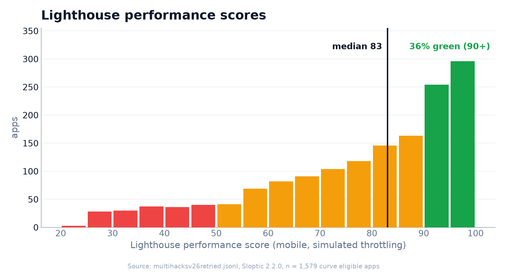

The median Lighthouse score is 83 (Q1 66, Q3 93, n = 1,538). 35.8% of apps reach green (90 or above) and
carry no performance slop. The metrics point at the client, not the server. Among the 991 apps with a
performance finding:

| metric | median | worst |
|---|---:|---:|
| time to first byte | 20 ms | 1.08 s |
| cumulative layout shift | 0.00 | 3.3 |
| first contentful paint | 2.7 s | 74.6 s |
| largest contentful paint | 4.0 s | 125.9 s |
| total blocking time | 320 ms | 167.8 s |

Servers answer fast, since most apps sit on a CDN edge, and layouts hold still. The page is slow because of
what it ships. The median flagged page weighs 4.1 MB, and the heaviest weighs 124 MB. Mean blocking time is
8.1 seconds against a median of 320 ms, because a few apps lock the main thread for minutes.

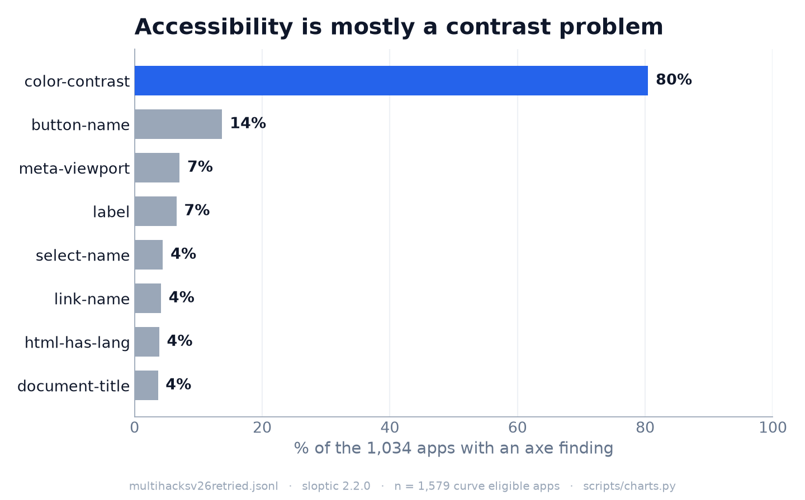

1,034 apps (65.5%) have an accessibility violation. Color contrast accounts for 80.5% of them. Unlabeled
buttons follow at 13.7%, then a viewport that blocks zoom (7.1%) and unlabeled form fields (6.6%). Missing
page language and missing titles are rare (under 4%), because modern scaffolds generate them. Contrast is the
one rule a scaffold cannot fix, since the team picks the colors.

## 5. Discussion

The typical app in this corpus works, and it lacks the basic hygiene that no demo exercises. It sends no
security headers. It ships a heavy bundle. Its text fails contrast. Past that floor, 58% of apps have at least
one real problem: a dead button, a crash on bad input, a page that takes seconds to paint, a reset email that
never comes. Each is a small fix, and each is invisible in a demo that clicks only the buttons that work.

Exploitable flaws are rarer, at 4.7%, and they concentrate in two places. Teams paste API keys into client
code, and AI builders connect a database without access rules. Both are configuration mistakes, not coding
mistakes. A grader finds them by reading what the app ships and asking the backend one question.

Worst case slop puts the numbers in scale. If every probe that applied to an app had fired at its highest
rung, the median app would score 2,078. Its actual median score is 48.0, so it realizes 2.2% of its possible
slop. The problem is not a few disastrous apps. It is a thin, universal layer of neglect.

The comparisons carry a practical point. Winning a hackathon says nothing about durability, the AI builder
risk is specific to the backend, and the four axes are independent. One number cannot summarize an app
without the axis breakdown, and judging cannot stand in for a durability check.

## 6. Limitations

- **Survivor bias.** 30% of links were dead before we graded them. The graded apps are the ones that stayed
  up.
- **Unauthenticated surface.** We reached a login protected surface on at most 14% of apps. Flaws behind a
  login are undercounted, so the exploitable rate is a lower bound.
- **Injection is unreachable here.** Most apps are static frontends, and a firewall challenged the heavy
  probes on 161 more. A zero fire rate for injection says nothing about injection risk.
- **Precision is partly audited.** The automatic audit found none of its known false positive classes among
  14,254 findings on all 1,734 scored records, but it has rules for only some probes: 62% of the penalty
  inside the score comes from probes without one. Most of that is presence checks (a header is missing, a
  control does nothing), where false positives are structurally rare. Every managed backend finding is
  confirmed by a live request.
- **Recall is unaudited.** We have no ground truth for what the grader missed.
- **Performance varies between runs.** Lighthouse verdicts flip on about 15% of apps from run to run near the
  90 line. Header findings flip on under 1%, accessibility on 2%, crash findings on 3% (906 apps graded
  twice).
- **Multiple comparisons.** We ran ten hypothesis tests and six axis correlations without correction. A
  Bonferroni correction over all sixteen (threshold 0.003) keeps the backend exposure, platform, surface size
  and winner performance axis results. The winner Lighthouse gap (p = 0.0034) falls just outside it, and the
  event result (p = 0.03) is not significant.
- **One population.** These are hackathon apps. The results do not describe production software.
- **Intent is out of scope.** The grader measures failures that count against any app. It does not judge
  whether an idea is good.

## 7. Conclusion

Seen from outside, hackathon web apps mostly fail the same way. The floor is missing everywhere, real
functional problems are common, and exploitable flaws are rare and clustered in leaked keys and open
databases. AI builders do not make apps sloppier overall, but their apps leave the backend open about 22
times as often.
Winning does not predict durability. The axes are independent, so a durability score has to report each
one separately.

## 8. Reproducing this report

```sh
# the numbers
uv run python scripts/stats.py multihacksv26retried.jsonl --all           # full text report
uv run python scripts/stats.py multihacksv26retried.jsonl --corpus-json   # validation/corpus-figures-active.json

# the figures and tests.csv
uv run --with matplotlib --with scipy python scripts/stats.py multihacksv26retried.jsonl --charts

# the frozen curve, and ranking one app against it
uv run python scripts/benchmark.py build multihacksv26retried.jsonl --version 2026.4 --status final
uv run python -m sloptic.cli --target https://your-app.example.com --out app.jsonl
uv run python scripts/benchmark.py rank --results app.jsonl
```

## References

- [Veracode, 2025 GenAI Code Security Report](https://www.veracode.com/resources/analyst-reports/2025-genai-code-security-report/)
- [Veracode, Spring 2026 GenAI Code Security update](https://www.veracode.com/blog/spring-2026-genai-code-security/)
- [Cloud Security Alliance, AI generated code vulnerability research note (2026)](https://labs.cloudsecurityalliance.org/research/csa-research-note-ai-codegen-vulnerability-debt-20260406-csa/)

## Appendix A: the 80 hackathons

Devpost event slugs, as ingested:

```
hack-brown-2026        ds-x                   bigred-hacks-2025      luddyhacks
innovation-hacks-2     hackgt-12              hacktech-by-caltech-2026  mhacks-2025
hacknyu-2025           vthacks-13             jumbohack-2025         devfest-2026
hack-mit-2023          ai-hackathon-2026      hacktx2025             jumbohack-2026
hackrice-15            hackprinceton-fall-2025  hackdartmouth-xi     hackbeanpot2025
la-hacks-2026          la-hacks-2025          treehacks-2026         bostonhacks-2025
hackharvard-2025       hackduke-code-for-good-2026  hackillinois-2026  hackcwru-012025
beaverhacks            boilermake-xii         terrahacks-2025        hackpsu-spring-2026
uwb-hacks-the-future   civic-hacks-2026       hackumass-xiii         uofthacks-13
deltahacks-12          hack-western-12        nwhacks-2026           hackku26
newhacks-2025          hacknc-2025            hacklondon-2026        hackupc-2026
kenthackit             emory-hacks-2025-fall  interhackbcn           steminate-hacks-2026
hackeurope             hack4her-mty           hackmty2025            hacknroll2026
uncommon-hacks-2026    swamphacks-xi          hack-arizona-2026      wildhacks-2026
nus-fintech-summit-2026  unihack2026          usaii-global-ai-hackathon-2026  hack-ireland-2025
oregonhacks            cs-girlies-wellness-hackathon  imaginehack2026  devleague-2026
vibehack-london-2026   civic-hacks            hack-brooklyn-2026     stem-connect-fall2025
byte-hacks             sb-hacks-xii           diamondhacks-2026      hacklahoma-2026
biggest-little-hackathon-2026  ellehacks-2026  hackrpi-2025          vibe-coder-hackathon
codecrunch-305hackathon-fall25  henhacks-2026  hack-for-humanity-26  hack-for-humanity-2026
```

## Appendix B: hypothesis tests

From `docs/charts/tests.csv`.

| hypothesis | test | n | p | detail |
|---|---|---|---:|---|
| Lovable slop > hand built slop | Mann-Whitney U, one sided | 73 / 1,497 | 0.16 | |
| backend exposure, AI builder vs hand built | Fisher exact | 82 / 1,497 | 4.4 × 10⁻¹⁰ | 11/82 vs 9/1,497, OR 25.6 |
| total slop, winners vs non winners | Mann-Whitney U, two sided | 247 / 1,332 | 0.22 | medians 52.7 vs 47.6 |
| slop outside performance, winners vs non winners | Mann-Whitney U, two sided | 247 / 1,332 | 0.48 | medians 33.5 vs 33.2 |
| performance axis, winners vs non winners | Mann-Whitney U, two sided | 247 / 1,332 | 0.001 | medians 10.9 vs 5.8 |
| Lighthouse score, winners vs non winners | Mann-Whitney U, two sided | 242 / 1,296 | 0.0034 | medians 78 vs 83.5 |
| surface size, winners vs non winners | Mann-Whitney U, two sided | 247 / 1,332 | 0.70 | medians 26 vs 25 |
| slop across host platforms (n ≥ 10) | Kruskal-Wallis | 10 groups, 1,565 | 3.7 × 10⁻⁶ | |
| slop across events (n ≥ 10) | Kruskal-Wallis | 49 groups, 1,410 | 0.03 | |
| slop vs observed surface size | Spearman | 1,579 | 2.9 × 10⁻⁸ | ρ = 0.14 |
| axis pairs | Spearman | 1,579 | | ρ from −0.01 to 0.14 |
| median slop | percentile bootstrap, 2,000 resamples | 1,579 | | 95% CI 45.9 to 51.0 |

*All figures are aggregate over the 2026.4 population. The report stores and reports no per app identities.*
